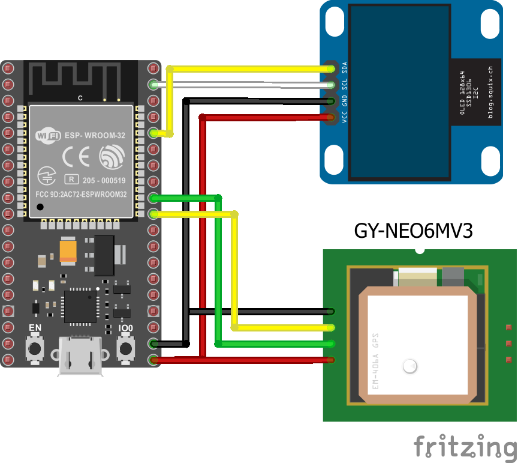

# Lorcòn/protocone
Everything you need to know about the main physical element of the game.

## Hardware
### Electronics
The basis of a protocone consists of *:
- An [ESP32](https://fr.aliexpress.com/item/32959541446.html).
- An [OLED Display](https://fr.aliexpress.com/item/4001028369082.html).
- A [NEOGM and its Antenna](https://fr.aliexpress.com/item/1005002632130603.html).
- A [USB battery shield](https://fr.aliexpress.com/item/32969651563.html).
- Two [Litium batteries](https://fr.aliexpress.com/item/32807032859.html).

And some wires and a USB cable. The assembly must respect the following scheme:

Basically:
- VCC <> 3.3V
- GND <> GND
- SCL <> GPIO 22 (I2C SCL)
- SDA <> GPIO 21 (I2C SDA)
- RX <> GPIO 17 (UART 2 TX)
- TX <> GPIO 16 (UART 2 RX)

\* The links are indicative, I am not an affiliate and I do not earn money if you click.

### Structure
- **WIP**

## Software
### Prerequisites
- You have [Arduino IDE](https://www.arduino.cc/en/software) (or equivalent) ready to use.
- You have the [ESP32 Board correctly added in Arduino IDE](https://randomnerdtutorials.com/getting-started-with-esp32/).
- The following [librairies](https://www.arduino.cc/en/guide/libraries) need to be installed:
    - [u8G2](https://github.com/olikraus/u8g2).
    - [TinyGPSPlus](https://github.com/mikalhart/TinyGPSPlus/).
    - [WiFi](https://www.arduino.cc/en/Reference/WiFi).
    - [Arduino_JSON](https://github.com/arduino-libraries/Arduino_JSON).

### Installation
- Nothing fancy to do, just clone the repo and `cd ./protocone/main/`.
- When you want to use the code, just upload it in the classical way.
- Feel free to read this [nice introduction to ESP32](https://randomnerdtutorials.com/getting-started-with-esp32/) before doing anything.

### Setup
`cp arduino_secret.h.dist arduino_secret.h` and edit the file with your own values.

## Usage
Each protocol needs a WiFi connection to the Internet (`SECRET_SSID` and `SECRET_PASSWORD`) and a server to process the data (`SECRET_SERVERNAME`). The values must therefore be correctly configured before uploading the code.

Once the code is uploaded, simply plug the battery directly into the USB port, and the protocone screen should light up.

**Important**: when powering up, make sure you are outside, so that the GPS module can find the GPS.

The screen should show the various configuration steps and then the information related to the protocol. If this is not the case, a little message will be displayed (see [Troubleshooting](#troubleshooting)).

## Troubleshooting
**Q:** I have nothing on the display.

**A:** First check that the ESP is switched on (small red LED on). Then check the wiring. If the wiring seems to be correct, the wiring should be rechecked. If there is really no problem with the wiring, remove the display from the circuit and mount it as a single circuit with the ESP ([example](https://randomnerdtutorials.com/esp32-ssd1306-oled-display-arduino-ide/)) to check that it is not the display that is damaged. If the display does not turn on, check that the correct driver is used (it depends on the displays). If everything looks OK, well... Change the screen!

##

**Q:** I have an error code on the display.

**A:** `TimeoutWFI` means that the WiFi connection was not successful after many attempts. Check your connection settings.

`No GPS` means that the GPS module is not responding. Check that the antenna is correctly connected, check that the module is correctly connected, possibly follow the [tutorial](https://randomnerdtutorials.com/guide-to-neo-6m-gps-module-with-arduino/) in the form of a simple circuit to check that data is being received, and if nothing works, change the module.

`TimeoutGPS` means that it was not possible to establish a connection with the GPS. The basic solution is to be effectively outside (i.e., sky visible to the antenna) when the device is turned on. If this is the very first time you are using the protocone, you may have to try again up to ten times (the GPS module memory has to "fill up" with the GPS locations). If it still doesn't work, try the [tutorial](https://randomnerdtutorials.com/guide-to-neo-6m-gps-module-with-arduino/) mentioned before. If still nothing, you probably need to change the antenna.

Note: To "easily" check that the GPS module is receiving data, there is normally a small LED flashing on the module.

##

**Q:** HELP!

**A:** Send me a message, @Stache on Telegram. We will figure something out. (:.
